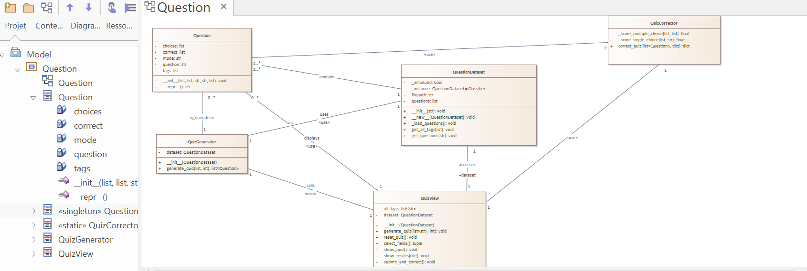
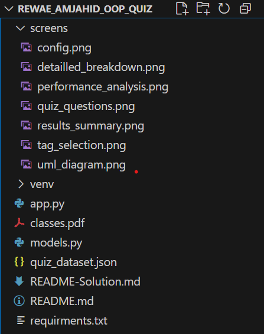
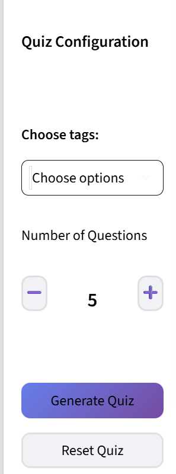
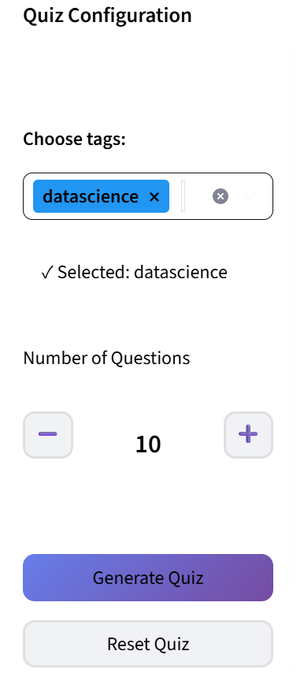
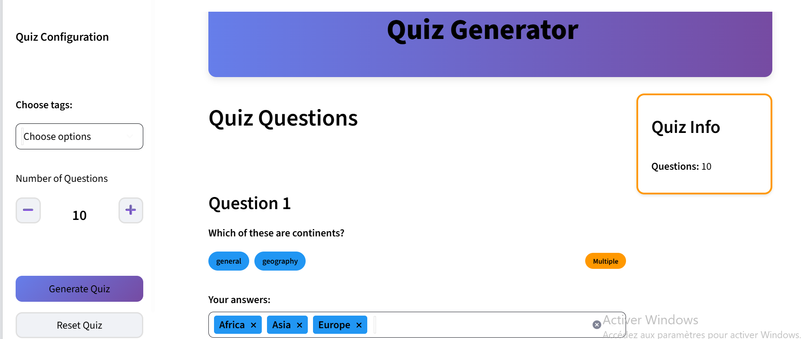
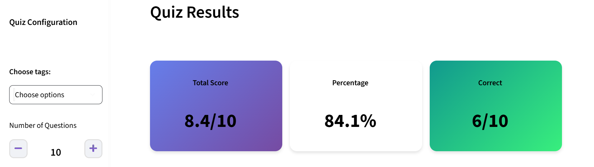
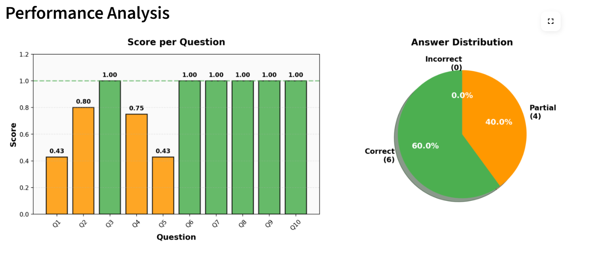
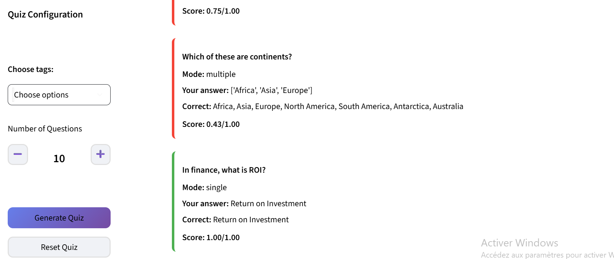

# Quiz Generator 
**Realized by :** REWAE AMJAHID  
**Course :** Object-Oriented Programming - Python - M2         
**Date :** 21 October 2025  
**GitHub :** https://github.com/rewaeamj/Project-OOP-Python-Interactive-Quiz-Application

---

## Introduction of the project 

This project is an **interactive quiz application** built with Python, Streamlit, and Object-Oriented Programming principles. The application allows users to generate customized quizzes based on selected tags, answer questions with different modes (single or multiple choice), and receive immediate scoring with detailed visual analytics.

### Project Goals

The main objectives of this project are:
- Apply **Object-Oriented Programming** concepts 
- Implement the **Singleton design pattern** for data management
- Create a **dynamic and interactive user interface** with Streamlit
- Develop **fair scoring algorithms** for single and multiple choice questions
- Provide **visual feedback** with charts and color-coded results

---

## UML Class Diagram



*Figure 1: UML Class Diagram of the Quiz Application*

### Diagram Description

This UML class diagram, created with **Enterprise Architect**, represents the complete architecture of the interactive quiz generator. The system is structured around **five main classes** that work together to provide a seamless quiz experience.

#### Classes Overview:

1. **Question** - Data model representing a single quiz question
   - Represents the fundamental unit of a quiz

2. **QuestionDataset** - Singleton class for data management
   - Ensures only one instance loads and manages all quiz questions

3. **QuizGenerator** - Quiz creation logic
   - Filters and selects questions based on user preferences

4. **QuizCorrector** - Scoring and evaluation engine
   - Implements different scoring algorithms for each question type

5. **QuizView** - User interface controller
   - Manages all Streamlit UI components and user interactions

### Design Patterns Used:

- **Singleton Pattern** → Used in `QuestionDataset` to ensure a single shared instance loads the data
- **MVC-like Architecture** → Clear separation between Models (business logic) and View (UI)

---

## Architecture & Design Patterns

### 1. Singleton Pattern Implementation

The `QuestionDataset` class implements the Singleton pattern to ensure that:
- The JSON file is loaded **only once** during application lifetime
- All components share the **same data instance**
- **Memory efficiency** is maintained


### 2. MVC-like Architecture

The application follows a Model-View-Controller pattern:

- **Models** (`models.py`):
  - `Question` - Data model
  - `QuestionDataset` - Data access layer
  - `QuizGenerator` - Business logic for quiz generation
  - `QuizCorrector` - Business logic for scoring

- **View** (`app.py`):
  - `QuizView` - UI controller and renderer
  - Handles all Streamlit components
  - Manages user interactions

### 3. Separation of Concerns

Each class has a single responsibility:
- `Question` → Represents data structure
- `QuestionDataset` → Manages data loading and storage
- `QuizGenerator` → Generates quizzes
- `QuizCorrector` → Evaluates answers
- `QuizView` → Handles UI and user interactions

---
### File Structure



## How It Works - Step by Step

### Step 1: Initial Configuration



*Figure 2: Initial sidebar configuration screen*

When the application starts, users see the **Quiz Configuration** panel in the sidebar with three main elements:

1. **Choose tags** dropdown (empty by default)
   - Allows selecting one or multiple topic tags
   - If no tags are selected, the quiz will include **all available question types**

2. **Number of Questions** counter
   - Default value: **5 questions**
   - Users can adjust using decrease and increase buttons
   - Range: 5 to 50 questions (increments of 5)
   - The selected number is displayed in a centered box

3. **Action buttons**
   - **"Generate Quiz"** : Creates a new quiz
   - **"Reset Quiz"** : Clears current quiz and starts fresh

---

### Step 2: Tag Selection and Configuration



*Figure 3: Selecting specific tags for quiz generation*

In this example, the user has:
- Selected the **"datascience"** tag 
- A confirmation message appears: **"✓ Selected: datascience"**
- Adjusted the number of questions to **10**

**How tag filtering works:**
- If one or more tags are selected, only questions containing at least one of those tags will be included
- Multiple tags can be selected to broaden the question pool
- Each selected tag appears as a removable badge in the multiselect box

**Customization options:**
- Users can change the number of questions at any time using the counter
- Tags can be added or removed before generation
- Clicking **"Generate Quiz"** creates a random selection of questions matching the criteria

---

### Step 3: Quiz Questions Display



*Figure 4: Generated quiz with multiple and single question types*

After clicking "Generate Quiz", the application displays:

**Main Elements:**

**Quiz Questions Section** :
   - Each question is numbered 
   - Question text displayed in bold
   - **Tag badges** showing the topics 
   - **Mode indicator**:
     - **Green "Single"** → Only one correct answer
     - **Orange "Multiple"** → Multiple correct answers possible

3. **Question Types:**

   **Single Choice Questions:**
   - Display as **radio buttons** 
   - User can select **only one option**
   - Example shown: "In finance, what is ROI?" -> RETURN on investment 

   
   **Multiple Choice Questions:**
   - Display as **checkboxes** in a multiselect dropdown
   - User can select **multiple options**
   - Example shown: Africa, Asia, Europe selected

4. **Quiz Info Panel** :
   - Shows total number of questions in the current quiz
   - Status indicator : orange border = In Progress

**User Experience:**
- Users scroll through all questions
- Answers are saved automatically in session state
- Users can change their answers before submitting

---

### Step 4: Results Summary



*Figure 5: Quiz results summary after submission*

After clicking **"Submit & Correct Quiz"**, the application displays three summary cards:

1. **Total Score Card** :
   - Shows the raw score achieved
   - Format: `X.X/Y` where X.X is the score and Y is the maximum
   - Example: `8.4/10` means 8.4 points out of 10 possible

2. **Percentage Card** :
   - Displays the success percentage
   - For Example in our submission : `84.1%` 

3. **Correct Count Card** :
   - Shows number of fully correct answers
   - **Green** background if Percentage : ≥ 70% -> excellent
   - **Orange** background if Percentage : 50-69% -> good
   - **Red** background if Percentage : < 50% -> needs improvement
   - Format: `X/Y` where X = correct, Y = total
   - Example: `6/10` means 6 questions answered perfectly

**Scoring Logic:**
- **Single choice:** 1.0 point if correct, 0.0 if wrong
- **Multiple choice:** Proportional score (0.0 to 1.0) based on the formula explained in the Scoring System section


**What happens next:**
- Users can scroll down to see detailed performance charts
- The "Detailed Breakdown" section shows question-by-question analysis

---

### Step 5: Performance Analysis Charts



*Figure 6: Visual analytics of quiz performance*

The **Performance Analysis** section contains two charts:

#### Chart 1: Score per Question (Bar Chart)

**What it shows:**
- Each bar represents one question (Q1, Q2, Q3, ...)
- Bar height indicates the score achieved (0.0 to 1.0)
- Numbers on top of each bar show the exact score

**Color Coding:**
- **Green bars** → Perfect score (1.00) - Fully correct answer
- **Orange bars** → Partial score (0.01-0.99) - Partially correct 
- **Red bars** → Zero score (0.00) - Incorrect answer

**Visual Elements:**
- Green dashed line at y=1.0 → Target (perfect score)
- Grid lines for easier reading
- X-axis rotated for better readability

**Example Analysis:**
- Q1: 0.43 (orange) - Partial credit on multiple choice
- Q2: 0.80 (orange) - Good but not perfect
- Q3: 1.00 (green) - Perfect answer
- Q4: 0.75 (orange) - Mostly correct
- Q5: 0.43 (orange) - Partial credit
- Q6-Q10: 1.00 (green) - All perfect

**Interpretation:** User performed excellently on questions 6-10 but struggled with questions 1, 4, and 5.

#### Chart 2: Answer Distribution (Pie Chart)

**What it shows:**
- Overall distribution of answer types
- Three categories with percentages

**Categories:**
- **Correct** (Green, 60.0%) - Questions answered perfectly -> 6 questions
  
- **Partial** (Orange, 40.0%) - Questions with partial credit -> 4 questions
  
- **Incorrect** (Gray, 0.0%) - Questions completely wrong -> 0 questions

**Analysis:**
- Got 6 out of 10 questions completely right (60%)
- Earned partial credit on 4 questions (40%)
- Had zero completely incorrect answers (0%)
- Overall strong performance with room for improvement on multiple choice questions

---

### Step 6: Detailed Breakdown



*Figure 7: Question-by-question detailed results*

The **"Detailed Breakdown"** expandable section shows complete information for each question:

#### Example 1: Incorrect Multiple Choice -> Red Border

**Question:** "Which of these are continents?"
- **Mode:** multiple
- **Your answer:** ['Africa', 'Asia', 'Europe']
- **Correct:** Africa, Asia, Europe, North America, South America, Antarctica, Australia
- **Score: 0.75/1.00** 

**Analysis:**
- User selected only 3 out of 7 continents
- Proportional scoring applied: (3 correct / 7 total) - (0 wrong / 7 total) = 3/7 ≈ 0.43
- Red left border indicates this answer was not perfect

#### Example 2: Correct Single Choice -> Green Border

**Question:** "In finance, what is ROI?"
- **Mode:** single
- **Your answer:** Return on Investment
- **Correct:** Return on Investment
- **Score: 1.00/1.00** 

**Analysis:**
- User selected the correct answer
- Green left border indicates success


**Educational Value:**
- The User can learn from their mistakes
- Correct answers are always shown
- Helps understand the difference between single and multiple choice
- Proportional scoring is transparent

---

## Implementation Details

### 1. Data Structure - Question Class

**Purpose:** Encapsulates all information about a quiz question.

---

### 2. Data Loading - QuestionDataset (Singleton)

**Singleton :**
- Ensures JSON file is read only once
- Saves memory and processing time
- All components share the same data

**How it works:**
1. First call creates the instance and loads data
2. Subsequent calls return the existing instance
3. `_initialized` flag prevents reloading

---

### 3. Quiz Generation - QuizGenerator

1. **Get all questions** from the dataset
2. **Filter by tags** if selected:
   - Uses list comprehension for efficiency
   - `any()` function checks if at least one tag matches
   - If no tags selected, use all questions
3. **Random selection**:
   - `random.sample()` ensures no duplicates
   - Adjusts count if not enough questions available
   - Returns a list of Question objects

---

### 4. Session State Management

Streamlit reruns the entire script on each interaction. To persist data, we use `st.session_state`:


**Variables Stored:**
- `quiz_generated` - Boolean flag indicating if quiz was created
- `questions` - List of Question objects for current quiz
- `user_answers` - Dictionary mapping question index to user's answer
- `quiz_corrected` - Boolean flag indicating if quiz was submitted
- `correction_results` - Dictionary containing scores and analysis
---

## Installation & Usage

### Step 1: Install Dependencies

```bash
pip install -r requirements.txt
```

### Step 2: Prepare Data

the `quiz_dataset.json` is our dataset in this project.

### Step 3: Run the Application

```bash
streamlit run app.py
```


The application will automatically open in the default browser at:
```
http://localhost:8501
```

---

## Conclusion

The application  **Interactive OOP Quiz Generator** implements key OOP concepts including **encapsulation**, **separation of concerns**, and the **Singleton design pattern** for efficient data management.

The application provides a complete quiz experience with dynamic generation, fair scoring algorithms, and visual performance analytics. Through this project, I gained hands-on experience in:

- Structuring applications with clear class responsibilities
- Implementing design patterns to solve real-world problems
- Building interactive user interfaces with Streamlit
- Managing application state and user interactions
- Creating data visualizations for enhanced user feedback

